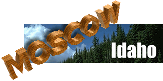
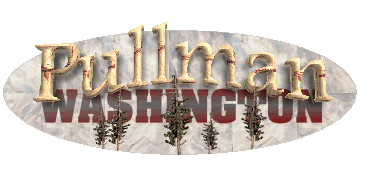

# First Step Research
They don't look like much now but at the time, being able to display an image on a web page was completely new. These were early days. 

- Created **circa 1993**

FSR was a local Internet dial-up company that sponsored three separate contests for each of its markets, to be voted on by its users. *I won all three*.

# Innovations

The 3D perspectives were created in [Caligari trueSpace](https://en.wikipedia.org/wiki/TrueSpace) then composited in [Altamira Composer](https://en.wikipedia.org/wiki/Altamira_Software) (for the time's standard grey pages) and finally saved as GIFs with transparency, a little known option.

